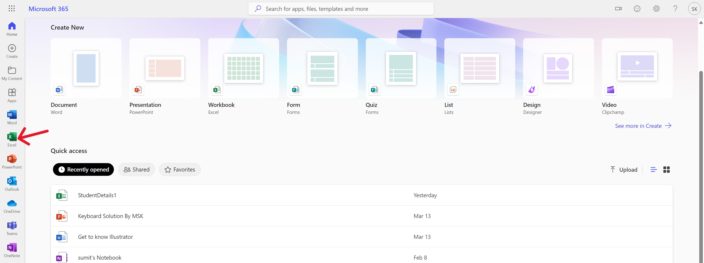
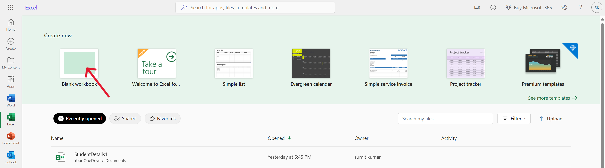
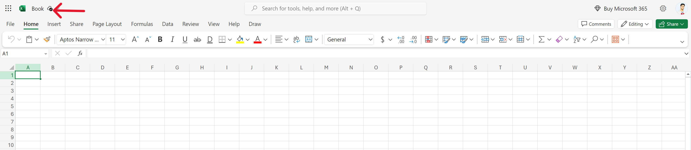
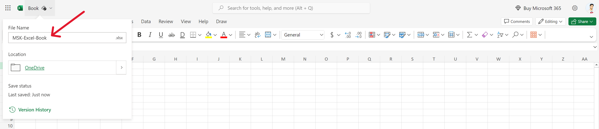
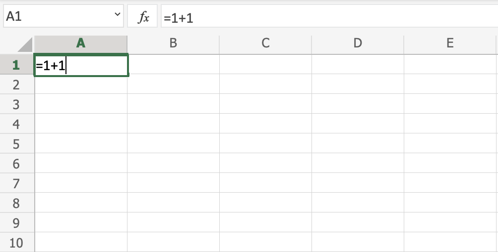

# Excel Get Started

## Office 365

The easiest way to get started with Excel, is to use Office 365.

Office 365 does not require downloading and installation of the program. It simply runs in your browser.

In our tutorial we will use Office 365, which can be accessed from [www.office.com](https://www.office.com).

## Open Excel

Once you have successfully logged into Office through [https://www.office.com/login](https://www.office.com/login), click on the Excel icon on the left side to enter the application:

## New Workbook
After entering the Excel application, click on the New blank workbook button to get started with a new workbook.

## Edit Book Name
Select Book Name For Edit Book Name

## Change Name
Enter a name `MSK-Excel-Book` for your workbook, and hit the `enter` button:

The Excel view has columns and rows, similar to a squared math exercise book.

Do not worry if the functionality looks overwhelming at first. You will get comfortable as you learn more in the chapters to come.

For now focus on the rows, columns, and the cells.

Ok. Let's make a function!

-   First, double click the cell `A1`, the one that is marked with the green rectangle in the picture.
-   Second, type `=1+1`.
-   Third, hit the **enter** button:

Congratulations! You have typed your first function, 1+1=2.

# [<<< Back](/01_Introducation/01_introducation.md) : : [Next >>>](/03_Overview/Overview.md)