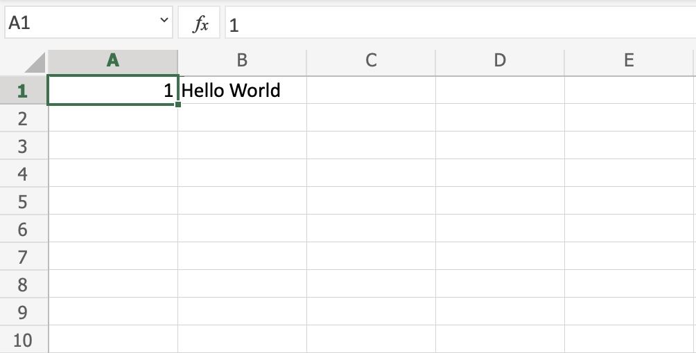

## Overview

This chapter is about giving you an overview of Excel. Excel's structure is made of two pieces, the **Ribbon** and the **Sheet**.

Have a look at the picture below. The **Ribbon** is marked with a red rectangle and the **Sheet** is marked with a yellow rectangle:

First, let's start with explaining the **Ribbon**.

___

## The Ribbon explained

The **Ribbon** provides shortcuts to Excel commands. A command is an action that allows you to make something happen. This can for example be to: insert a table, change the font size, or to change the color of a cell.

The **Ribbon** may look crowded and hard to understand at first. Don't be scared, It will become easier to navigate and use as you learn more. Most of the time we tend to use the same functionalities over again.

The **Ribbon** is made up by the **App launcher**, **Tabs**, **Groups** and **Commands**. In this section we will explain the different parts of the **Ribbon**.

### App launcher

The App launcher icon has nine dots and is called the Office 365 navigation bar. It allows you to access the different parts of the Office 365 suite, such as Word, PowerPoint and Outlook. App launcher can be used to switch seamlessly between the Office 365 applications.

### Tabs

The tab is a menu with sub divisions sorted into groups. The tabs allow users to quickly navigate between options of menus which display different groups of functionality.

### Groups

The groups are sets of related commands. The groups are separated by the thin vertical line break.

### Commands

The commands are the buttons that you use to do actions.

Now, let's have a look at the **Sheet**. Soon you will be able to understand the relationship between the **Ribbon** and the **Sheet**, and you can make things happen.

___

## The Sheet explained

The **Sheet** is a set of rows and columns. It forms the same pattern as we have in math exercise books, the rectangle boxes formed by the pattern are called cells.

Values can be typed to cells.

Values can be both numbers and letters:

>Each cell has its unique reference, which is its coordinates, this is where the columns and rows intersect.

Let's break this up and explain by an example

Have a look at the picture below. Hello world was typed in cell `C4`. The reference can be found by clicking on the relevant cell and seeing the reference in the **Name Box** to the left, which tells you that the cell's reference is `C4`.

Another way to find the reference is to first find the column, in this case `C`, then map that towards the row, in this case `4`, which gives us the reference of `C4`.

**Note:** The reference of the cell is its coordinates. For example, `C4` has the coordinates of column `C` and row `4`. You find the cell in the intersection of the two. The letter is always the column and the number is always the row.

___

## Multiple Sheets

You start with one **Sheet** by default when you create a new workbook. You can have many sheets in a workbook. New sheets can be added and removed. Sheets can be named to making it easier to work with data sets.

**Are you up for the challenge?** Let's create two new sheets and give them useful names.

First, click the plus icon, shown in the picture below, create two new sheets:

>**Tip:** You can use the hotkey **Shift + F11** to create new sheets. Try it!

Second, right click with your mouse on the relevant sheet and click rename:

Third, enter useful names for the three sheets:

In this example we used the names **Data Visualization**, **Data Structure** and **Raw Data**. This is a typical structure when you are working with data.

**Good job!** You have now created your first workbook with three named sheets!

# [<<< Back](/02_Get_Started/01_Get_Started.md) : : [Next >>>](/04_Syntax/Syntax.md)