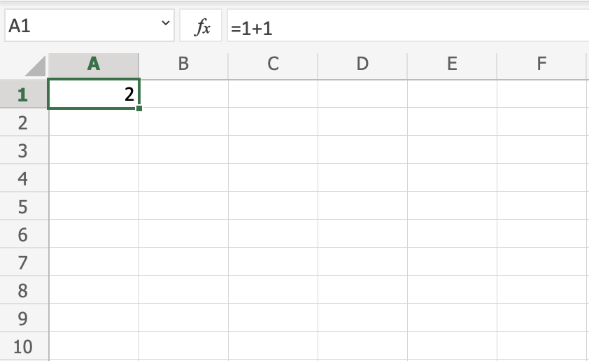
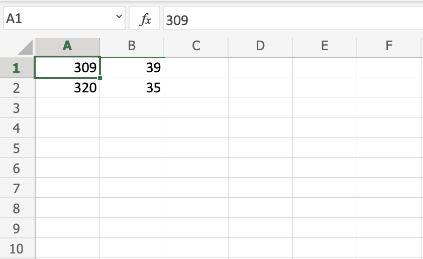
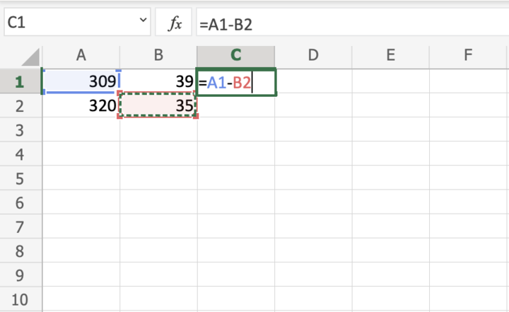
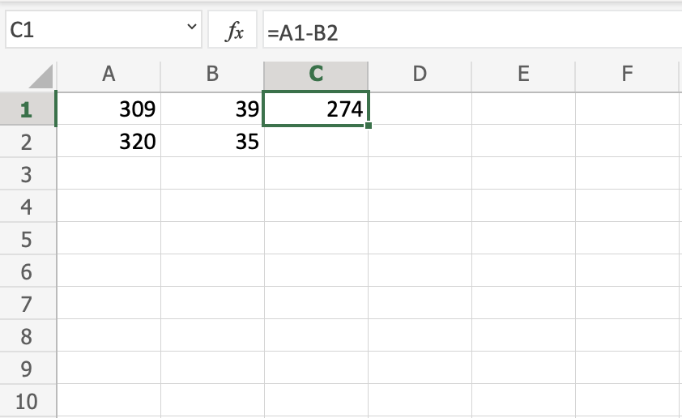
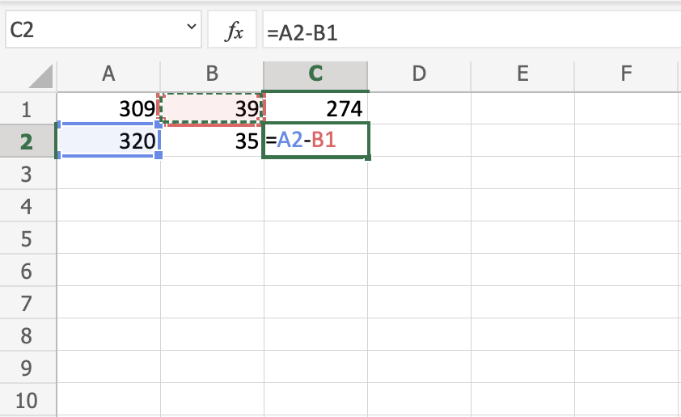
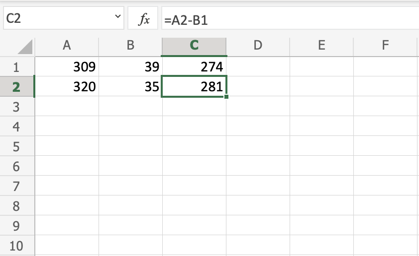

## Syntax

A formula in Excel is used to do mathematical calculations. Formulas always start with the equal sign `=` typed in the cell, followed by your calculation.

**Note:** You claim the cell by selecting it and typing the equal sign (`=`)

### Creating formulas, step by step

-   Select a cell
-   Type the equal sign (=)
-   Select a cell or type value
-   Enter an arithmetic operator
-   Select another cell or type value
-   Press enter

For example `=1+1` is the formula to calculate **1+1=2**

>**Note:** The value of a cell is communicated by **reference(value)** for example `A1(2)`
___

## Using Formulas with Cells

You can type values to cells and use them in your formulas.

Lets type some dummy values to get started. Double click the cells to type values into them. Go ahead and type:

-   `A1(309)`
-   `A2(320)`
-   `B1(39)`
-   `B2(35)`

Compare with the picture shown below:

>**Note:** Type values by selecting a cell, claim it by entering the equal sign (`=`) and then type your value. For example `=309`.

**Well done!** You have successfully typed values to cells and now we can use them to create formulas.

Here is how to do it, step by step.

1.  Select the cell `C1`
2.  Type the equal sign (`=`)
3.  Left click on `A1`, the cell that has the `(309)` value
4.  Type the minus sign (`-`)
5.  Left click on `B2`, the cell that has the `(35)` value
6.  Hit enter

>**Tip:** The formula can be typed directly without clicking the cells. The typed formula would be the same as the value in `C1` `(=A1-B2)`.

| =A1-B2 | Result |
| -------- | -------- |
|  |  |

The result after hitting the enter button is `C1(274)`. Did you make it?
___

## Another Example

Let's try one more example, this time let's make the formula `=A2-B1`.

Here is how to do it, step by step.

1.  Select the cell `C2`
2.  Type the equal sign (`=`)
3.  Left click `A2`, the cell that has the `(320)` value
4.  Type the minus sign (`-`)
5.  Left click `B1`, the cell that has the `(39)` value
6.  Hit the enter button

| =A1-B2 | Result |
| -------- | -------- |
|  |  |

You got the result `C2(281)`, right? **Way to go!**

**Note:** You can make formulas with all four arithmetic operations, such as addition (+), subtraction (-), multiplication (\*) and division (/).

Here are some examples:

-   `=2+4 gives you 6`
-   `=4-2 gives you 2`
-   `=2*4 gives you 8`
-   `=2/4 gives you 0.5`

In the next chapter you will learn about **Ranges** and how data can be moved in the **Sheet**.

# [<<< Back](/03_Overview/Overview.md) : : [Next >>>](/05_Ranges/Ranges.md)