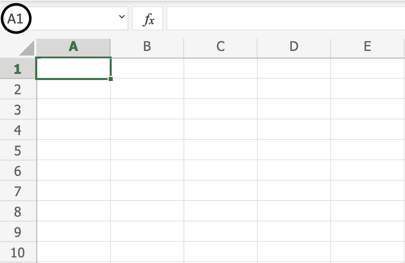
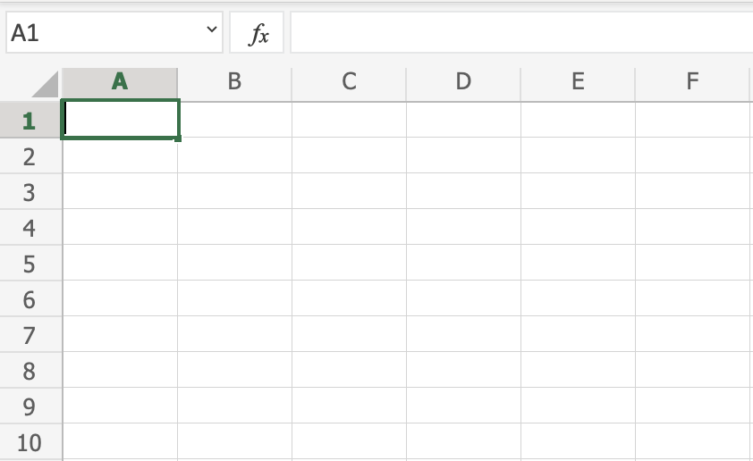
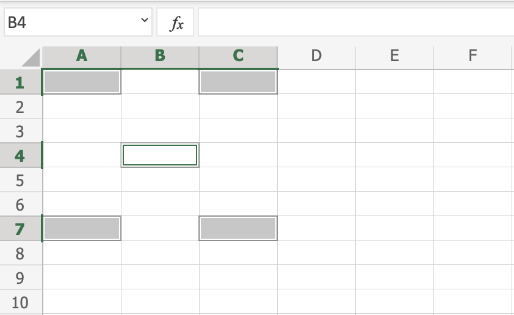
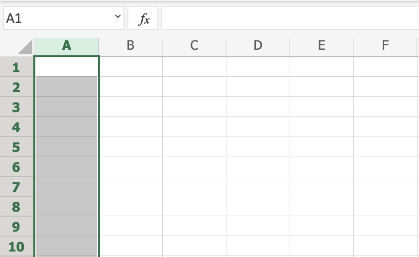
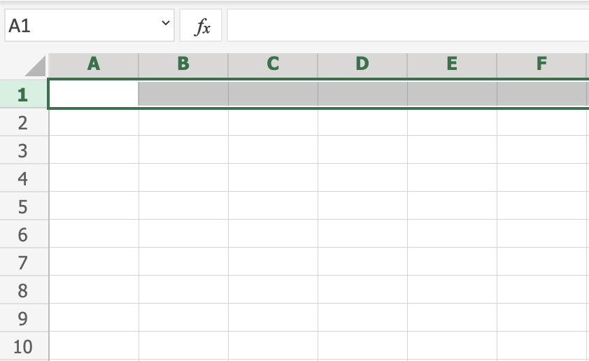
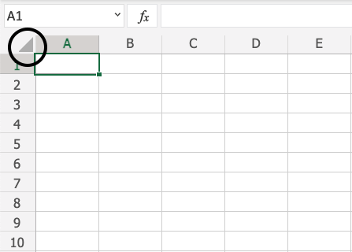
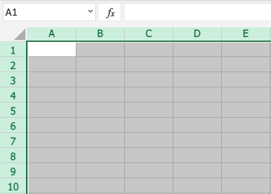
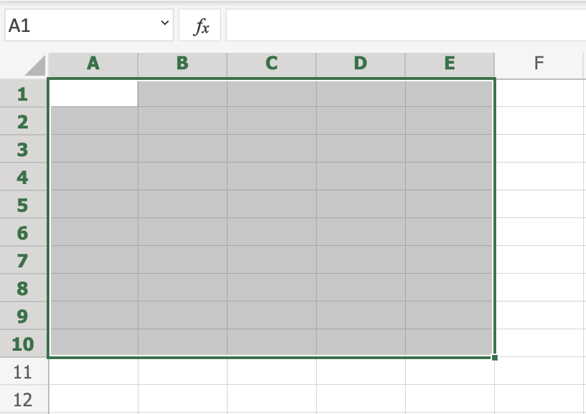
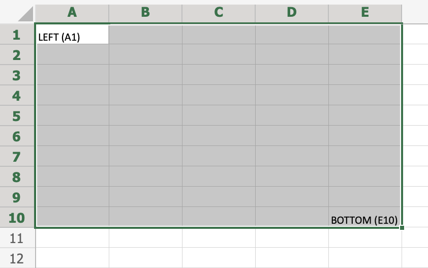

## Ranges

Range is an important part of Excel because it allows you to work with selections of cells.

There are four different operations for selection;

-   Selecting a cell
-   Selecting multiple cells
-   Selecting a column
-   Selecting a row

Before having a look at the different operations for selection, we will introduce the Name Box.

___

## The Name Box

The Name Box shows you the reference of which cell or range you have selected. It can also be used to select cells or ranges by typing their values.

You will learn more about the Name Box later in this chapter.

___

## Selecting a Cell

Cells are selected by clicking them with the left mouse button or by navigating to them with the keyboard arrows.

It is easiest to use the mouse to select cells.

To select cell `A1`, click on it:

## Selecting Multiple Cells

More than one cell can be selected by pressing and holding down **CTRL** or **Command** and left clicking the cells. Once finished with selecting, you can let go of **CTRL** or **Command**.

Lets try an example: Select the cells `A1`, `A7`, `C1`, `C7` and `B4`.

Did it look like the picture below?

## Selecting a Column

Columns are selected by left clicking it. This will select all cells in the sheet related to the column.

To select **column A**, click on the letter A in the column bar:

## Selecting a Row

Rows are selected by left clicking it. This will select all the cells in the sheet related to that row.

To select **row 1**, click on its number in the row bar:

## Selecting the Entire Sheet
The entire spreadsheet can be selected by clicking the triangle in the top-left corner of the spreadsheet: 

Now, the whole spreadsheet is selected:

**Note:** You can also select the entire spreadsheet by pressing `Ctrl+A` for Windows, or `Cmd+A` for MacOS.

___

## Selection of Ranges

Selection of cell ranges has many use areas and it is one of the most important concepts of Excel. Do not think too much about how it is used with values. You will learn about this in a later chapter. For now let's focus on how to select ranges.

There are two ways to select a range of cells

1.  Name Box
2.  Drag to mark a range.

The easiest way is drag and mark. Let's keep it simple and start there.

How to drag and mark a range, step-by-step:

1.  Select a cell
2.  Left click it and hold the mouse button down
3.  Move your mouse pointer over the range that you want selected. The range that is marked will turn grey.
4.  Let go of the mouse button when you have marked the range

Let's have a look at an example for how to mark the range `A1:E10`.

**Note:** You will learn about why the range is called `A1:E10` after this example.

___

Select cell `A1`:

Press and hold `A1` with the left mouse button. Move to the mouse pointer to mark the selection range. The grey area helps us to see the covered range.

Let go of the left mouse button when you have marked the range `A1:E10`:

You have successfully selected the range `A1:E10`. **Well done!**

The second way to select a range is to enter the range values in the Name Box. The range is set by first entering the cell reference for the top left corner, then the bottom right corner. The range is made using those two as coordinates. That is why the cell range has the reference of two cells and the **:** in between.

**Top left corner reference : Right bottom corner reference**

The range shown in the picture has the value of `A1:E10`:

The best way for now is to use the drag and mark method as it is easier and more visual.

In the next chapter you will learn about filling and how this applies to the ranges that we have just learned.

