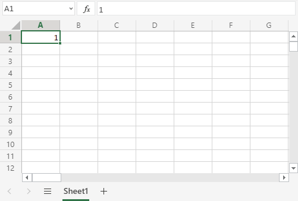

## Filling

Filling makes your life easier and is used to fill ranges with values, so that you do not have to type manual entries.

Filling can be used for:

-   Copying
-   Sequences
-   Dates
-   Functions (\*)

For now, do not think of functions. We will cover that in a later chapter.

___

## How To Fill

Filling is done by selecting a cell, clicking the fill icon and selecting the range using drag and mark while holding the left mouse button down.

The fill icon is found in the bottom right corner of the cell and has the icon of a small square. Once you hover over it your mouse pointer will change its icon to a thin cross.

Click the fill icon and hold down the left mouse button, drag and mark the range that you want to cover.

In this example, cell `A1` was selected and the range `A1:A10` was marked.

Now that we have learned how to fill. Let's look into how to copy with the fill function.

___

## Fill Copies

Filling can be used for copying. It can be used for both numbers and words.

Let's have a look at numbers first.

In this example we have typed the value `A1(1)`:

Filling the range `A1:A10` creates **ten copies** of **1**:

The same principle goes for text.

In this example we have typed `A1(Hello World)`.

Filling the range `A1:A10` creates ten copies of "Hello World":

Now you have learned how to fill and to use it for copying both numbers and words. Let's have a look at sequences.
___

## Fill Sequences

Filling can be used to create sequences. A sequence is an order or a pattern. We can use the filling function to continue the order that has been set.

Sequences can for example be used on numbers and dates.

Let's start with learning how to count from 1 to 10.

This is different from the last example because this time we do not want to copy, but to count from 1 to 10.

Start with typing `A1(1)`:

First we will show an example which does not work, then we will do a working one. Ready?

Lets type the value (`1`) into the cell `A2`, which is what we have in `A1`. Now we have the same values in both `A1` and `A2`.

Let's use the fill function from A1:A10 to see what happens. Remember to mark both values before you fill the range.

What happened is that we got the same values as we did with copying. This is because the fill function assumes that we want to create copies as we had two of the same values in both the cells `A1(1)` and `A2(1)`.

Change the value of `A2(1)` to `A2(2)`. We now have two different values in the cells `A1(1)` and `A2(2)`. Now, fill `A1:A10` again. Remember to mark both the values (holding down shift) before you fill the range:

**Congratulations!** You have now counted from 1 to 10.

The fill function understands the pattern typed in the cells and continues it for us.

That is why it created copies when we had entered the value (`1`) in both cells, as it saw no pattern. When we entered (`1`) and (`2`) in the cells it was able to understand the pattern and that the next cell `A3` should be (`3`).

Let's create another sequence. Type `A1(2)` and `A2(4)`:

Now, fill `A1:A10`:

It counts from `2 to 20` in the range `A1:A10`.

This is because we created an order with `A1(2)` and `A2(4)`.

Then it fills the next cells, `A3(6)`, `A4(8)`, `A5(10)` and so on. The fill function understands the pattern and helps us continue it.

___

## Sequence of Dates

The fill function can also be used to fill dates.

**Note:** The date format depends on you [regional language settings](https://www.w3schools.com/excel/excel_filling.phpexcel_format_settings.php).

For example `14.03.2023` vs. `3/14/2023`.

Test it by typing `A1(29.07.2021)`:

And fill the range `A1:A10`:

The fill function has filled 10 days from `A1(29.07.2021)` to `A10(07.08.2021)`.

Note that it switched from July to August in cell `A4`. It knows the calendar and will count real dates.

___

## Combining Words and Letters

Words and letters can also be combined.

Type `A1(Hello 1)` and `A2(Hello 2)`:

Next, fill `A1:A10` to see what happens:

The result is that it counts from `A1(Hello 1)` to `A10(Hello 10)`. Only the numbers have changed.

It recognised the pattern of the numbers and continued it for us. Words and numbers can be combined, as long as you use a recognizable pattern for the numbers.

