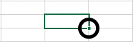
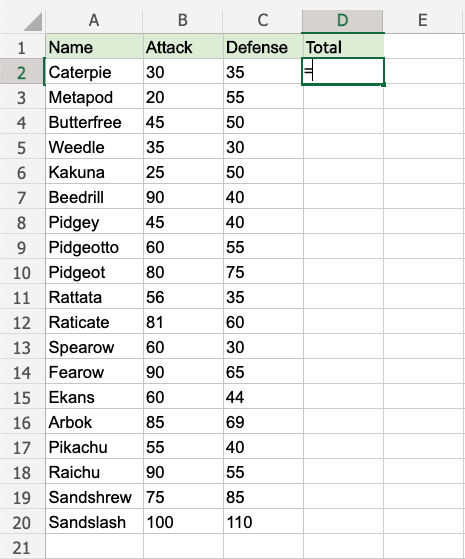
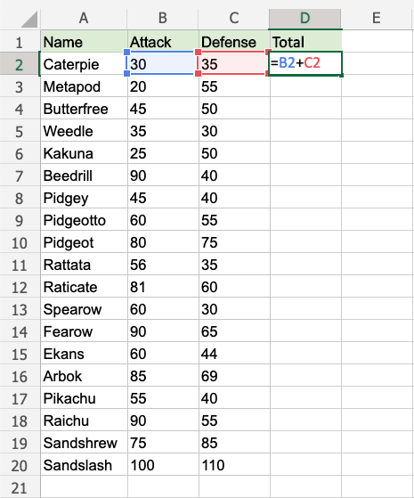
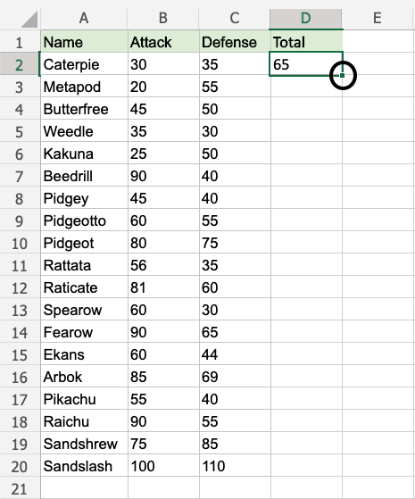
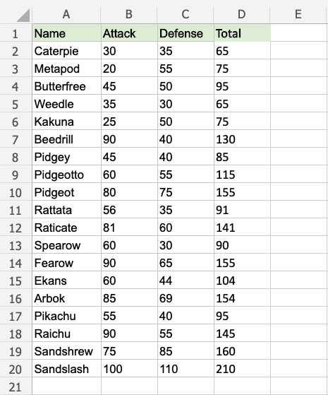
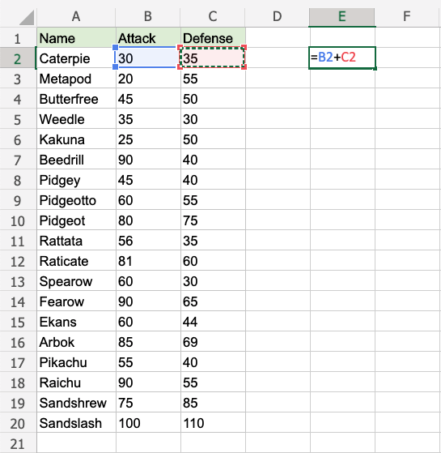
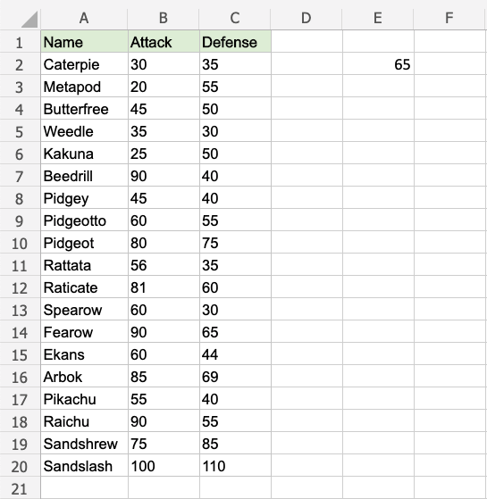
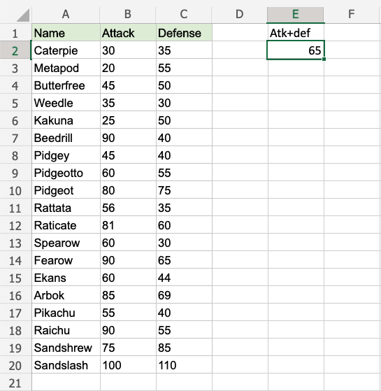
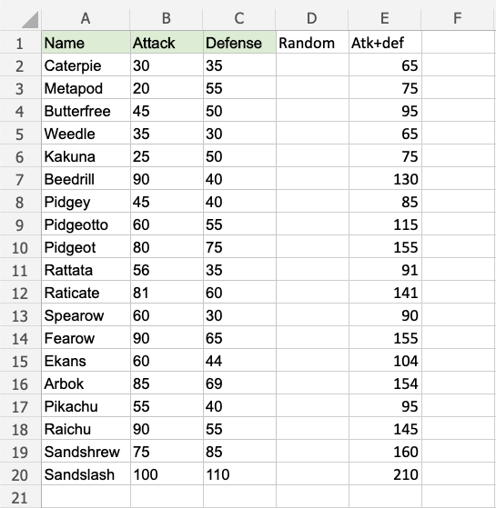

## Double Click to Fill

The **fill function** can be **double clicked** to complete formulas in a range:

**Note:** For the double click to work it has to see a recognizable pattern.

For example: by using headers, or with the formulas in the columns or rows next to the data.

### Double Click to Fill Example

Let's use the Double click fill function to calculate the Attack`B2:B20` + Defense `C2:C20` for the Pokemons in the range `D2:D20`.

1.  Select `D2`
2.  Type `=`

-   Select `B2`
-   Type `+`
-   Select `C2`

-  Hit enter 

- Double click the fill function

**Way to go!** The function understands the pattern and completes the calculation for `D2:D20`. Note that it stops when there is no more data to calculate, at row **20**.

___

## A Non-Working Example

Delete values in the range `D1:D20`

Enter the formula "=B2+C2" in `E2`

**Note:** There is no header for Columns **D** and **E**. There are blank cells in between.

Double click the fill function.

Waiting...

The fill function is just loading without filling the rows. It is not understanding the pattern.

**Give it more clues.**

Add a header to see what happens. Enter "Atk+def" in `E1`

Double click the fill function.

**Loading... Still nothing...**

One more header. Enter "Random" in `D1`

Double click the fill function.

**Is the gap closed?**

**There we go!** The function recognised the pattern and filled in the formulas for each row.

Adding headers helped the function to understand the relationship between the data.
